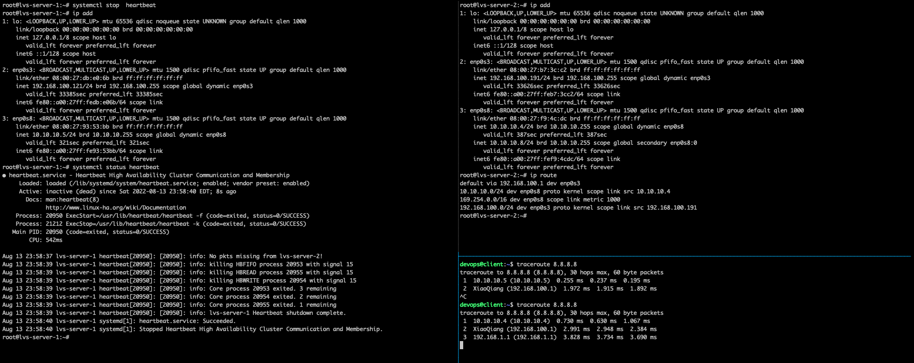

# HA

A simple way to use linux as a router.

```bash
apt-get install -y heartbeat
cp -rp /usr/share/doc/heartbeat/ha.cf.gz /etc/ha.d/
cp -rp /usr/share/doc/heartbeat/haresources.gz /etc/ha.d
cp -rp /usr/share/doc/heartbeat/authkeys /etc/ha.d/

cd /etc/ha.d/

gzip -d ha.cf.gz
gzip -d haresources.gz
```

authkeys

```text
auth 2
2 sha1 test-ha
```

```bash
chmod 600 authkeys
```

ha.cf 

```text
logfile	/var/log/ha-log
logfacility	local0
keepalive 2
deadtime 30
initdead 120
udpport	694
bcast enp0s3
auto_failback on
node lvs-server-1
node lvs-server-2
```

haresources

```text
lvs-server-1 IPaddr::10.10.10.8/24/enp0s8
```

## set network

### enable system forward the traffic
```bash
echo 1 > /proc/sys/net/ipv4/ip_forward
```

save to sysctl.conf

```
net.ipv4.ip_forward = 1
```

### set firewall

```bash

#!/bin/bash

/sbin/iptables -t nat -A POSTROUTING -o enp0s3 -j MASQUERADE
/sbin/iptables -A FORWARD -i enp0s3 -o enp0s8 -m state --state RELATED,ESTABLISHED -j ACCEPT
/sbin/iptables -A FORWARD -i enp0s8 -o enp0s3 -j ACCEPT

# /sbin/iptables -t nat -D POSTROUTING -o enp0s3 -j MASQUERADE
# /sbin/iptables -D FORWARD -i enp0s3 -o enp0s8 -m state --state RELATED,ESTABLISHED -j ACCEPT
# /sbin/iptables -D FORWARD -i enp0s8 -o enp0s3 -j ACCEPT
```

Notes: 

- enp0s3 is the internet/out bound interface.
- enp0s8 is intrant interface.

### check the server side route

```bash
ip route
```

## do some tests





